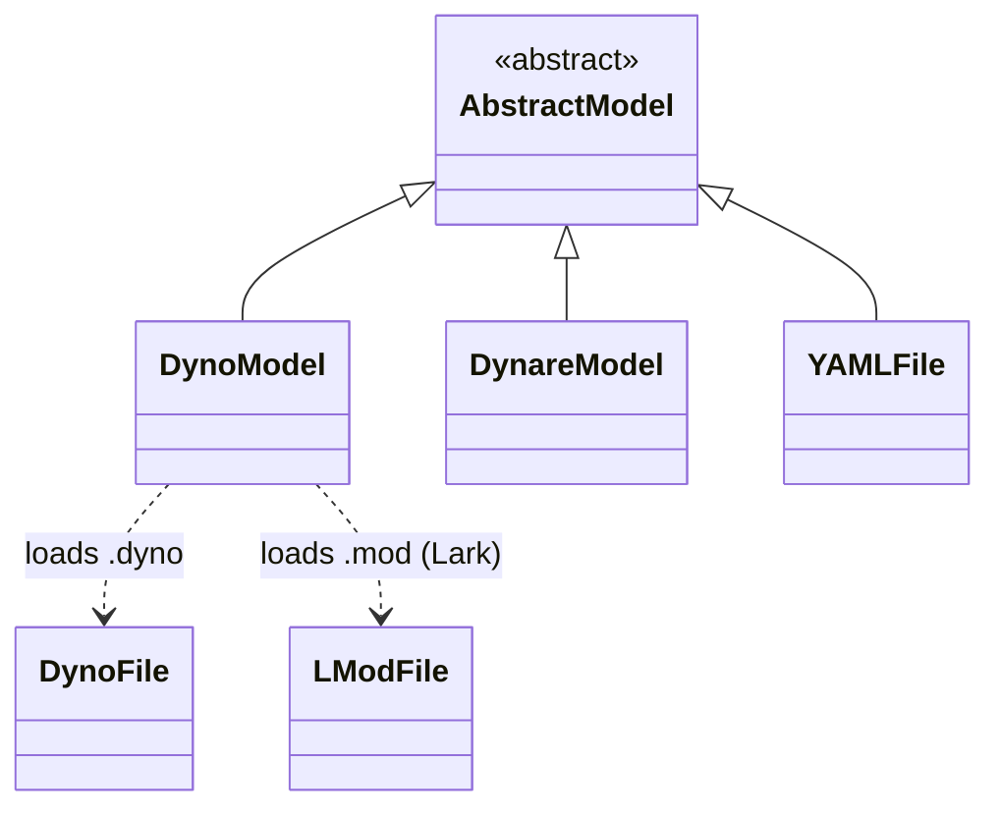

# Hierarchy of Model Classes

Notes:

- `AbstractModel` is the abstract base class for models.
- `DynoModel`, `DynareModel`, and `YAMLFile` are the main concrete model types.
- `DynoModel` uses `DynoFile` / `LModFile` (both `SymbolicFile` subclasses) to parse textual model descriptions.
