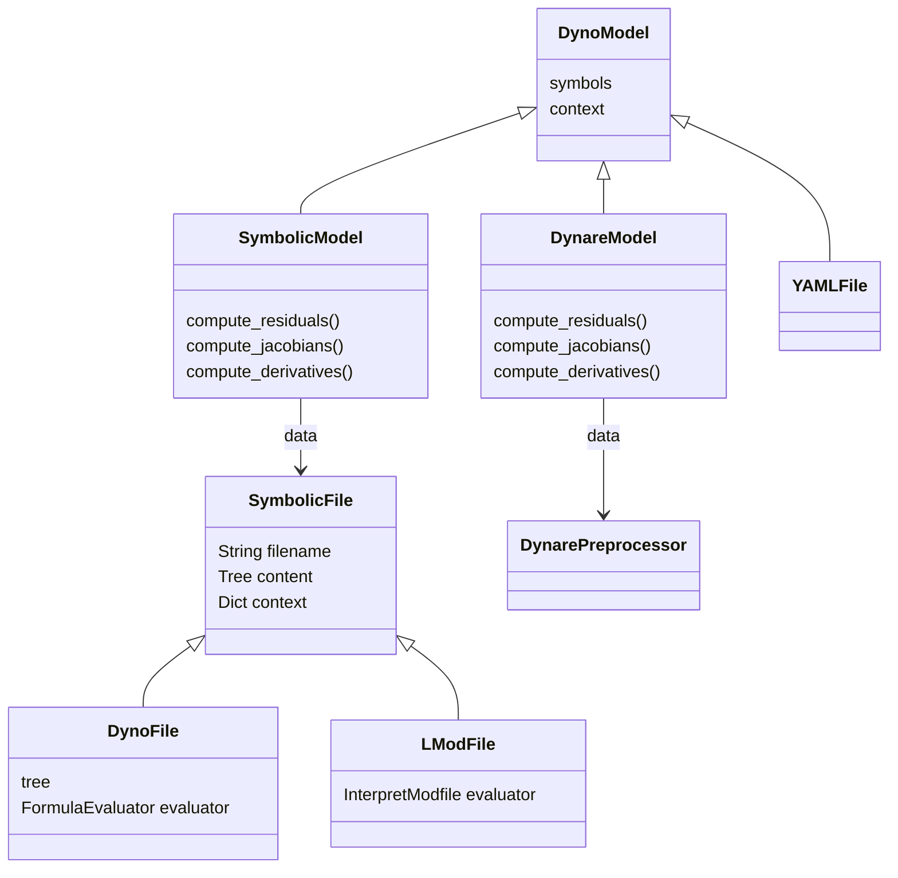

# Hierarchy of Classes (clean)

## Legend

- <|-- : Inheritance (subclass)
- o--  : Composition / has-a
- -->  : Association / uses
- ..>  : Reference

Notes:

- `DynareModel` is implemented in `src/dyno/modfile.py` and `modfile_lark.py` and wraps Dynare's preprocessor.
- `SymbolicModel` loads `.dyno` / `.mod` files via `DynoFile` / `LModFile` (subclasses of `SymbolicFile`).
- `YAMLFile` is an alternate `Model` implementation for YAML-described models.
- `Model.processes` may hold a `ProductNormal` (exogenous process).
