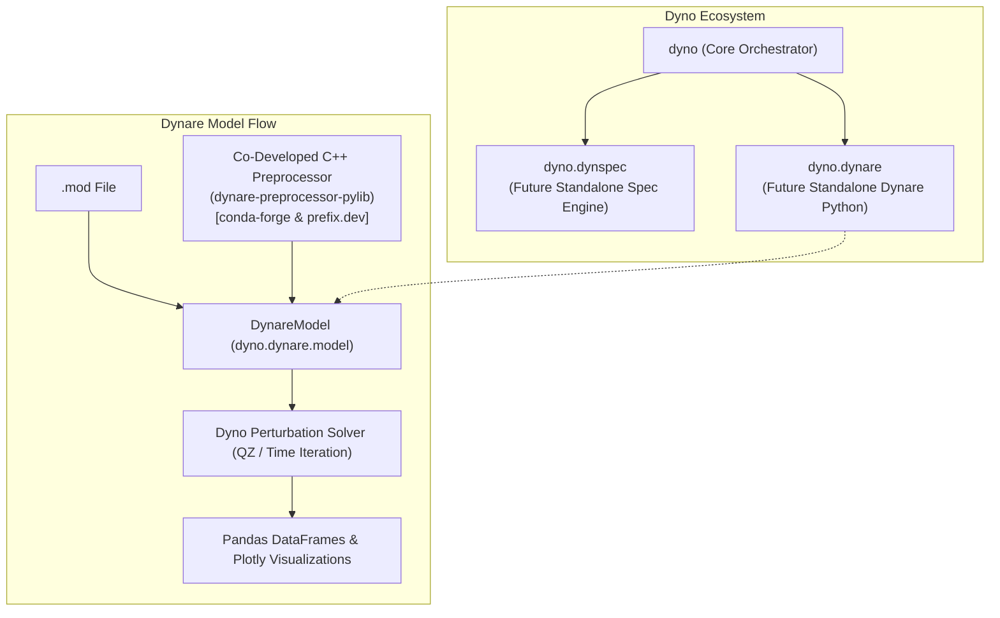

# Dynare in Python (`dyno.dynare`)

**`dyno.dynare`** is a dedicated subpackage within Dyno that serves as the development incubator for the new version of **Dynare in Python**.

Much like **DynSpec** (which encapsulates model specification, AST parsing, and automatic differentiation before becoming an independent package), `dyno.dynare` is architected with strict boundary separation so that it can evolve into an **independent, standalone `dynare` Python package**.

---

## Why a Dedicated `dynare` Subpackage?

Dynare has been the industry standard for macroeconomic modeling and DSGE simulation for decades, primarily running in MATLAB. The modern quantitative economics community increasingly relies on the Python scientific stack (NumPy, SciPy, Pandas, Plotly, JupyterLab).

Developing the new Python version of Dynare within Dyno provides:

- **Incubation & Co-Evolution**: Rapidly iterate on Pythonic Dynare abstractions while leveraging Dyno's high-performance perturbation solvers, steady-state engines, and reporting infrastructure.
- **Future Package Autonomy**: Clear API boundaries ensure that when `dynare` is spun off as a standalone package, downstream code requires zero architectural refactoring.
- **Dual Preprocessor Strategy**:

  - `dyno.dynare.DynareModel`: Integrates with the official, co-developed C++ Dynare preprocessor Python library (`dynare-preprocessor-pylib`) for complete 1-to-1 fidelity with legacy `.mod` syntax and macro-processing commands.
  - `dyno.DynoModel`: Pure-Python Lark-based parser for `.mod` files that runs anywhere without C++ compilation.



---

## Co-Developed C++ Preprocessor Python Library (`dynare-preprocessor-pylib`)

A cornerstone of the Python Dynare initiative is **`dynare-preprocessor-pylib`**, a co-developed Python library wrapping the official Dynare C++ preprocessor codebase.

### Availability on conda-forge & prefix.dev

The preprocessor library is packaged and distributed across modern package registries:

- **prefix.dev**: Available via the [`econforge`](https://prefix.dev/econforge) channel.
- **conda-forge**: Available directly through the community [`conda-forge`](https://conda-forge.org/) channel.

You can install it into your environment using `pixi` or `conda`:

```bash
# Via prefix.dev (EconForge channel)
pixi add --channel https://prefix.dev/econforge dynare-preprocessor-pylib

# Via conda-forge
pixi add --channel conda-forge dynare-preprocessor-pylib
```

### Key Technical Roles

1. **Native In-Memory Parsing**: Binds directly to the C++ parser without invoking external command-line binaries or intermediate file serialization, exposing the preprocessed model AST as native Python data structures.
2. **Macro-Processing Parity**: Faithfully executes complex macro-processing commands (`@#include`, `@#for`, `@#define`, `@#if/@#endif`) exactly as Dynare in MATLAB does.
3. **Symbol & Equation Extraction**: Seamlessly extracts variable blocks (`var`, `varexo`, `parameters`), equation declarations, parameter values, and lead/lag auxiliary variable mapping into the `symbolic.context` dictionary.
4. **Foundation for Standalone Dynare**: As `dyno.dynare` transitions into an independent package, `dynare-preprocessor-pylib` serves as the official C++ compilation backend powering command emulation and model ingestion.

---

## Subpackage Contents

Currently, `dyno.dynare` contains the core `DynareModel` class:

```text
src/dyno/dynare/
├── __init__.py      # Exports DynareModel
└── model.py         # DynareModel implementation (preprocessor bridge & lifecycle)
```

### `DynareModel`

[`DynareModel`](../api/models.md) implements the [`AbstractModel`](../api/models.md) interface for Dynare models:

```python
from dyno.dynare import DynareModel

# Load and compile a Dynare .mod file using the official preprocessor
model = DynareModel("examples/modfiles/RBC.mod")

# Verify steady-state residuals
model.check()

# Solve for first-order decision rules
solution = model.solve()

# Inspect transition matrix X and shock impact matrix Y
print("Transition Matrix X:\n", solution.X)
print("Impact Matrix Y:\n", solution.Y)

# Generate impulse response functions
irfs = solution.irfs(type="deviation", T=40)
```

---

## Programmatic Compatibility

To guarantee backward compatibility across existing scripts and tutorials:

- **Direct Subpackage Import**:
  ```python
  from dyno.dynare import DynareModel
  ```
- **Top-Level Re-Export**:
  ```python
  from dyno import DynareModel
  ```
- **Legacy Module Forwarding**:
  ```python
  from dyno.dynare_model import DynareModel  # Deprecated alias pointing to dyno.dynare.model
  ```

---

## Roadmap Towards an Independent Package

As `dyno.dynare` matures toward graduation as a standalone package, the following milestones are being implemented:

1. **Full Command Emulation**: First-class Python implementations of standard Dynare commands (`stoch_simul`, `steady`, `check`, `forecast`, `estimation`).
2. **Native Python Preprocessor**: Deep integration with modern parser engines to eliminate platform-dependent binary wheels where possible.
3. **DynSpec AST Interoperability**: Direct bidirectional compilation between Dynare `.mod` grammar and DynSpec AST representations.
4. **Standalone CLI**: A dedicated `dynare` terminal utility for batch model execution and report generation.
