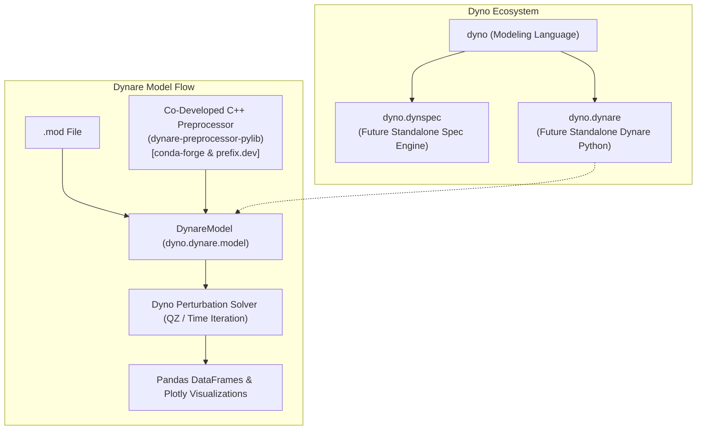

# Dynare in Python (`dyno.dynare`)

**`dyno.dynare`** provides Python support for Dynare `.mod` files. It bridges existing Dynare models with the Python scientific stack (NumPy, SciPy, Pandas, Plotly).

---

## Two Parsing Backends for `.mod` Files

Dyno offers two ways to load and run Dynare `.mod` files:

1. **`DynareModel` (`dyno.dynare.DynareModel`)**:
   - Requires the optional `dynare-preprocessor-pylib` package (see
     [Preprocessor Integration](#preprocessor-integration-dynare-preprocessor-pylib)
     below); it is not installed with `dyno` itself.
   - Integrates directly with the C++ Dynare preprocessor Python bindings (`dynare-preprocessor-pylib`).
   - Provides full fidelity with official Dynare preprocessing, including macro-processor directives (`@#include`, `@#for`, `@#define`, `@#if`).
   - Available via conda-forge and prefix.dev.

2. **`DynoModel` (`dyno.DynoModel`)**:
   - Pure-Python parser built with Lark.
   - Requires no external C++ dependencies or compiled binaries.
   - Reads standard `.mod` files for perturbation and simulation workflows,
     including perfect-foresight files (`shocks` with `periods`/`values`,
     `initval`/`endval`/`histval`, `perfect_foresight_setup`/`_solver`, `simul`).


```mermaid
graph TD
    subgraph "Dyno Ecosystem"
        DYNO["dyno (Modeling Language)"]
        DYNSPEC["dyno.dynspec<br/>(Future Standalone Spec Engine)"]
        DYNARE["dyno.dynare<br/>(Future Standalone Dynare Python)"]
    end

    subgraph "Dynare Model Flow"
        MOD[".mod File"] --> DM["DynareModel (dyno.dynare.model)"]
        CPP["Co-Developed C++ Preprocessor<br/>(dynare-preprocessor-pylib)<br/>[conda-forge & prefix.dev]"] --> DM
        DM --> SOLVE["Dyno Perturbation Solver (QZ / Time Iteration)"]
        SOLVE --> OUT["Pandas DataFrames & Plotly Visualizations"]
    end

    DYNARE -.-> DM
    DYNO --> DYNARE
    DYNO --> DYNSPEC
```

---

## Preprocessor Integration (`dynare-preprocessor-pylib`)

The C++ Dynare preprocessor is packaged as a Python library: `dynare-preprocessor-pylib`.

### Installation

The preprocessor library is available on conda-forge and prefix.dev:

```bash
# Via prefix.dev (EconForge channel)
pixi add --channel https://prefix.dev/econforge dynare-preprocessor-pylib

# Via conda-forge
pixi add --channel conda-forge dynare-preprocessor-pylib
```

### Preprocessor Features

1. **In-Memory Parsing**: Directly binds to the C++ preprocessor without invoking subprocesses or writing intermediate files.
2. **Macro-Processing**: Evaluates Dynare macro-processing directives (`@#include`, `@#for`, `@#define`, `@#if/@#endif`).
3. **Symbol & Equation Extraction**: Populates variable blocks (`var`, `varexo`, `parameters`), equations, and auxiliary lead/lag variables into model context dictionaries.

---

## Subpackage Contents

Currently, `dyno.dynare` contains the core `DynareModel` class:

```text
src/dyno/dynare/
├── __init__.py      # Exports DynareModel
└── model.py         # DynareModel implementation (preprocessor bridge & lifecycle)
```

### `DynareModel`

[`DynareModel`](../api/models.md) implements the [`AbstractModel`](../api/models.md) interface for Dynare models:

```python
from dyno.dynare import DynareModel

# Load and compile a Dynare .mod file using the official preprocessor
model = DynareModel("examples/modfiles/RBC.mod")

# Verify steady-state residuals
model.check()

# Solve for first-order decision rules
solution = model.solve()

# Inspect transition matrix X and shock impact matrix Y
print("Transition Matrix X:\n", solution.X)
print("Impact Matrix Y:\n", solution.Y)

# Generate impulse response functions
irfs = solution.irfs(type="deviation", T=40)
```

---

## Programmatic Compatibility

To guarantee backward compatibility across existing scripts and tutorials:

- **Direct Subpackage Import**:
  ```python
  from dyno.dynare import DynareModel
  ```
- **Top-Level Re-Export**:
  ```python
  from dyno import DynareModel
  ```

---

## Roadmap Towards an Independent Package

As `dyno.dynare` matures toward graduation as a standalone package, the following milestones are being implemented:

1. **Full Command Emulation**: First-class Python implementations of standard Dynare commands (`stoch_simul`, `steady`, `check`, `forecast`, `estimation`).
2. **Native Python Preprocessor**: Deep integration with modern parser engines to eliminate platform-dependent binary wheels where possible.
3. **DynSpec AST Interoperability**: Direct bidirectional compilation between Dynare `.mod` grammar and DynSpec AST representations.
4. **Standalone CLI**: A dedicated `dynare` terminal utility for batch model execution and report generation.
