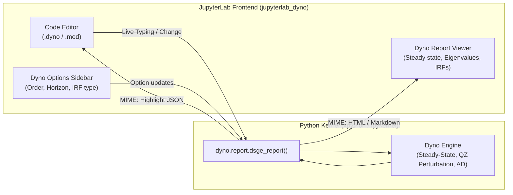

# Dyno Lab (JupyterLab Extension)

**Dyno Lab** (`jupyterlab_dyno`) is the official interactive web-based graphical user interface for DSGE modeling in Dyno. Built as a native JupyterLab extension, Dyno Lab provides a live, synchronized side-by-side workspace for authoring, solving, and visualizing dynamic economic models.

Dyno Lab natively supports both Dyno model specifications (`.dyno`, `.dyno.yaml`) and legacy Dynare files (`.mod`).

---

## Why Dyno Lab?

Previous computational economics tools often required switching between a code editor, a terminal or MATLAB console, and external plotting windows. While early Dyno prototypes explored standalone web dashboards (such as Solara), **Dyno Lab embeds directly into the JupyterLab IDE**, combining:

- **Integrated Editor & Diagnostics**: Syntax highlighting, code navigation, and inline line-level error reporting.
- **Reactive Background Engine**: Edits trigger automatic background re-solving without manual execution commands.
- **Interactive Visualization**: Embedded Plotly impulse response functions and moment tables.
- **Multi-Document Workflow**: Manage multiple models simultaneously with coordinated split-pane views.



---

## Installation

`jupyterlab_dyno` is distributed as a conda/pixi package through the EconForge channel on Prefix.dev.

### With Pixi

Add `jupyterlab_dyno` to your Pixi project:

```bash
pixi add --channel https://repo.prefix.dev/econforge jupyterlab_dyno
```

Alternatively, add the channel permanently to your `pixi.toml`:

```toml
[project]
channels = ["https://repo.prefix.dev/econforge", "conda-forge"]

[dependencies]
dyno = ">=0.0.1"
jupyterlab_dyno = "*"
```

### With Micromamba

Install directly into your existing conda/mamba environment:

```bash
micromamba install -c https://repo.prefix.dev/econforge jupyterlab_dyno
```

### Building from Source

For extension developers or contributors:

```bash
git clone https://github.com/EconForge/jupyterlab-dyno.git
cd jupyterlab-dyno

# Install development dependencies
pixi install

# Launch JupyterLab with the extension enabled
pixi run lab
```

To run continuous watch-mode compilation during development:

```bash
pixi run watch
```

---

## Launching Dyno Lab

To start the environment, launch JupyterLab from your terminal:

```bash
pixi run -e dev jupyter lab
```

Once JupyterLab opens in your browser:

1. Navigate the file browser to any `.dyno` or `.mod` model file.
2. Double-click the file to open it.
3. Dyno Lab automatically opens the file in the code editor on the left and creates an interactive, live Dyno Report viewer on the right.
