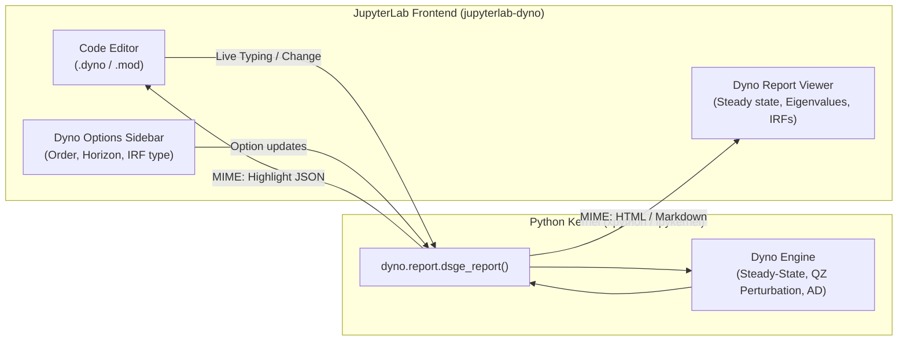

# Dyno Lab (JupyterLab Extension)

**Dyno Lab** (`jupyterlab-dyno`) is the official interactive web-based graphical user interface for DSGE modeling in Dyno. Developed and maintained as an **independent package** in the EconForge ecosystem, Dyno Lab is a native JupyterLab extension providing a live, synchronized side-by-side workspace for authoring, solving, and visualizing dynamic economic models.

Dyno Lab natively supports both Dyno model specifications (`.dyno`, `.dyno.yaml`) and legacy Dynare files (`.mod`).

---

## Why Dyno Lab?

Previous computational economics tools often required switching between a code editor, a terminal or MATLAB console, and external plotting windows. While early Dyno prototypes explored standalone web dashboards (such as Solara), **Dyno Lab embeds directly into the JupyterLab IDE**, combining:

- **Integrated Editor & Diagnostics**: Syntax highlighting, code navigation, and inline line-level error reporting.
- **Reactive Background Engine**: Edits trigger automatic background re-solving without manual execution commands.
- **Interactive Visualization**: Embedded Altair impulse response functions and moment tables.
- **Multi-Document Workflow**: Manage multiple models simultaneously with coordinated split-pane views.


```mermaid
graph LR
    subgraph Frontend ["JupyterLab Frontend (jupyterlab-dyno)"]
        ED["Code Editor<br/>(.dyno / .mod)"]
        OPT["Dyno Options Sidebar<br/>(Order, Horizon, IRF type)"]
        VIEW["Dyno Report Viewer<br/>(Steady state, Eigenvalues, IRFs)"]
    end

    subgraph Backend ["Python Kernel (xpython / ipykernel)"]
        REP["dyno.report.dsge_report()"]
        ENG["Dyno Engine<br/>(Steady-State, QZ Perturbation, AD)"]
    end

    ED -- "Live Typing / Change" --> REP
    OPT -- "Option updates" --> REP
    REP --> ENG
    ENG --> REP
    REP -- "MIME: HTML / Markdown" --> VIEW
    REP -- "MIME: Highlight JSON" --> ED
```

---

## Installation

`jupyterlab-dyno` is distributed as a conda package on the **`econforge`** channel on prefix.dev (`https://prefix.dev/econforge`), like Dyno itself. It does not depend on JupyterLab, so install JupyterLab alongside it.

### With Pixi

In a Pixi project (see [Install Dyno](../getting_started/installation.md) to create one), add the `econforge` channel if you have not already, then add JupyterLab and the extension:

```bash
pixi workspace channel add --prepend https://prefix.dev/econforge
pixi add jupyterlab jupyterlab-dyno
```

`--prepend` puts the `econforge` channel before `conda-forge`, so Pixi installs the latest releases from `econforge`. Your `pixi.toml` then contains something like:

```toml
[workspace]
channels = ["https://prefix.dev/econforge", "conda-forge"]

[dependencies]
dyno = ">=0.1.11,<0.2"
jupyterlab = ">=4.5,<5"
jupyterlab-dyno = ">=0.1.0,<0.2"
```

(the exact version constraints depend on the current releases).

### With Micromamba

Install directly into your existing conda/mamba environment:

```bash
micromamba install -c https://prefix.dev/econforge -c conda-forge jupyterlab jupyterlab-dyno
```

### Building from Source

For extension developers or contributors:

```bash
git clone https://github.com/EconForge/jupyterlab-dyno.git
cd jupyterlab-dyno

# Install development dependencies
pixi install

# Launch JupyterLab with the extension enabled
pixi run lab
```

To run continuous watch-mode compilation during development:

```bash
pixi run watch
```

---

## Launching Dyno Lab

To start the environment, launch JupyterLab from your Pixi project:

```bash
pixi run jupyter lab
```

(When working on Dyno itself, the repository's `dev` environment already includes Dyno Lab: use `pixi run -e dev jupyter lab`; see [Develop Dyno](../getting_started/development.md).)

Once JupyterLab opens in your browser:

1. Navigate the file browser to any `.dyno` or `.mod` model file.
2. Double-click the file to open it.
3. Dyno Lab automatically opens the file in the code editor on the left and creates an interactive, live Dyno Report viewer on the right.
