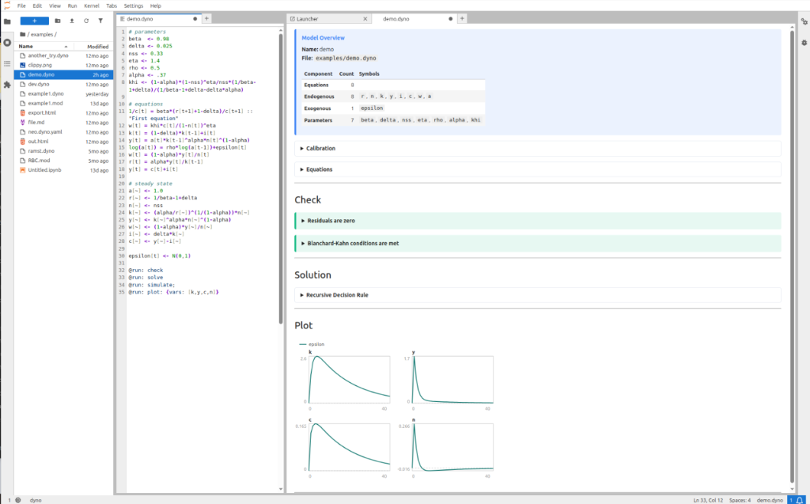

# Dyno Lab (JupyterLab Extension)

**Dyno Lab** (`jupyterlab_dyno`) is the official interactive extension for DSGE and macroeconomic modeling in JupyterLab. It provides a synchronized, side-by-side workspace: edit models in `.dyno` or Dynare `.mod` files on the left, and inspect live steady-state checks, decision rules, and simulation charts on the right.



---

## Key Features

- **Live Reactive Solving**: Edits in the editor automatically trigger background re-solving without manual execution commands.
- **Pipeline Directives (`@run:`)**: Declare execution steps directly in model files (`@run: check`, `@run: solve`, `@run: simulate`, `@run: plot: {vars: [k, y, c, n]}`).
- **Comprehensive Visual Reports**: Real-time steady-state verification, Blanchard-Kahn stability diagnostics, eigenvalues, and interactive Altair impulse response charts.
- **Inline Diagnostics**: Line-level syntax and typo error highlighting directly in the editor gutter.
- **Multi-Document Support**: Seamlessly switch between multiple model files with synchronized split panes.

---

## Installation

Add `jupyterlab_dyno` to your Pixi project from the EconForge channel:

```bash
pixi add --channel https://repo.prefix.dev/econforge jupyterlab_dyno
```

Or install with micromamba / conda:

```bash
micromamba install -c https://repo.prefix.dev/econforge jupyterlab_dyno
```

---

## Quick Start

1. Launch JupyterLab:
   ```bash
   pixi run -e dev jupyter lab
   ```
2. Double-click any `.dyno` or `.mod` file in the file browser.
3. Dyno Lab opens the model editor on the left and immediately displays the live interactive Dyno Report on the right.

