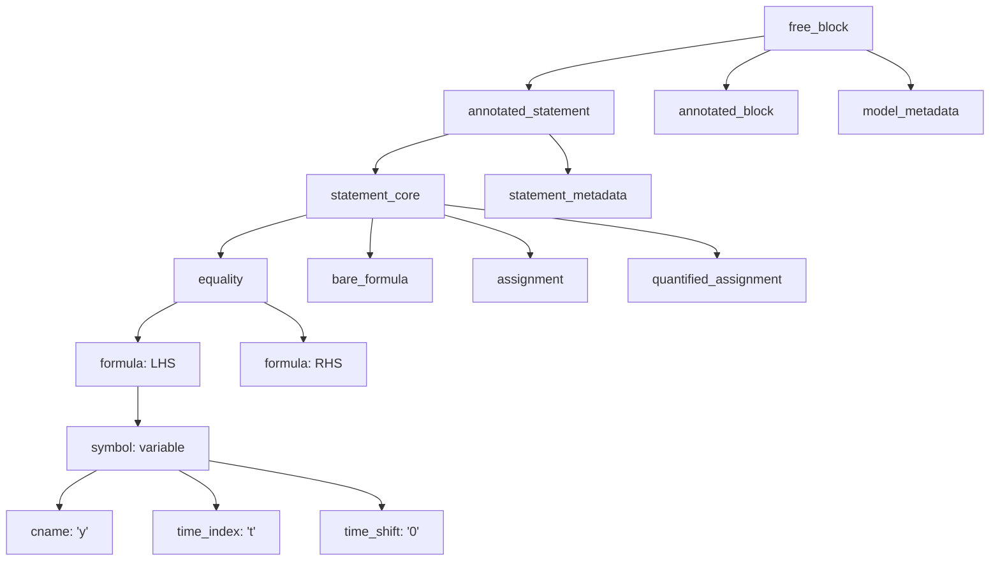

# Grammar, Parsing & Abstract Syntax Trees

DynSpec uses [Lark](https://github.com/lark-parser/lark), a parsing toolkit for Python, to build typed, error-resilient Abstract Syntax Trees (ASTs) from economic model files.

---

## The Grammar Definition (`grammar.lark`)

DynSpec's grammar is defined in `grammars/grammar.lark`. It utilizes an **LALR(1)** parsing engine with character-level position tracking.

### Entry Points

The parser supports multiple start symbols depending on what is being parsed:

| Start Symbol | Scope | Used For |
|---|---|---|
| `free_block` *(default)* | Full file | Complete `.dyno` files containing metadata, blocks, and assignments |
| `equation_block` | Multi-line equations | Blocks enclosed in `{ ... }` or equation groups |
| `assignment_block` | Calibration blocks | Series of assignments (`<-` or `:=`) |
| `formula` | Single expression | Standalone mathematical expressions |

```python
from dyno.dynspec.grammar import parser

# Parse a complete model
tree_full = parser.parse(full_text, start="free_block")

# Parse an equation block
tree_eqs = parser.parse("y[t] = c[t] + i[t]\nk[t] = (1-d)*k[t-1] + i[t]", start="equation_block")

# Parse a standalone formula
tree_expr = parser.parse("alpha * (k[t-1]^alpha) * (n[t]^(1-alpha))", start="formula")
```

---

## Core AST Hierarchy

The parsed tree decomposes source code into a clean, hierarchical structure:



### Key Syntax Rules

```lark
# Equality vs. Residual (bare_formula)
equality: formula "=" formula
bare_formula: formula

# Assignments
assignment: symbol _ASSIGN formula
quantified_assignment: _FORALL "t" ["," t_double_bound] ":" variable _ASSIGN formula

# Symbols
variable: cname "[" time_index time_shift "]"
value:    cname "[" time "]"
constant: cname
```

---

## The `TimeFixer` Transformer

In economic models, researchers write `x[t]` to denote contemporaneous variables, and `x[t-1]` or `x[t+1]` for lagged and lead variables.

In the raw Lark grammar, `time_shift` is an optional rule:
```lark
!time_index: ("t"|"~")
!time_shift: [SIGNED_INT2]
```

When no shift is written (as in `k[t]`), `time_shift` initially yields `None`. To prevent downstream analyzers from needing null-checks everywhere, DynSpec integrates a built-in `TimeFixer` transformer:

```python
class TimeFixer(Transformer):
    @v_args(tree=True)
    def shift(self, tree):
        if tree.children[0] is None:
            return Tree("shift", ["0"])
        return tree
```

Every variable node in the resulting AST is guaranteed to possess a normalized shift:
- `k[t]` $\implies$ `Tree('variable', [cname('k'), index('t'), shift('0')])`
- `k[t-1]` $\implies$ `Tree('variable', [cname('k'), index('t'), shift('-1')])`
- `k[~]` $\implies$ `Tree('variable', [cname('k'), index('~'), shift('0')])`

---

## Source Location Tracking & Diagnostics

Lark is configured with `propagate_positions=True`, attaching accurate line and column coordinates to every AST node:

```python
tree = parser.parse("y[t] = exp(z[t]) * k[t-1]^alpha", start="equation_block")

eq = tree.children[0]
print(f"Line: {eq.meta.line}, Column: {eq.meta.column}")
print(f"End Line: {eq.meta.end_line}, End Column: {eq.meta.end_column}")
```

This precise location tracking powers Dyno's human-readable error diagnostics and warnings.
