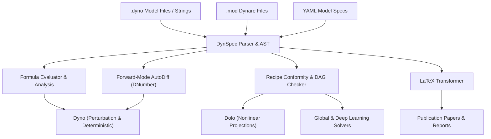

# DynSpec Specification Engine

<p align="left">
  <span class="badge badge-success">Standalone Architecture</span>
  <span class="badge">Lark Grammar</span>
  <span class="badge">Forward AutoDiff</span>
  <span class="badge">Recipe Validation</span>
  <span class="badge badge-warning">Target: Independent Package</span>
</p>

**DynSpec** is the symbolic, parsing, and code-generation engine underlying Dyno. While currently distributed as `dyno.dynspec`, DynSpec is architected with strict boundary separation so that it can be extracted into an **independent, solver-agnostic package** for dynamic economic model specification.

---

## Why DynSpec?

In computational economics, model representation and model solution have historically been tightly coupled within specific software suites (such as Dynare in MATLAB or Dolo in Python). This tight coupling creates several challenges:

- Re-implementing parsers and AST interpreters across different solvers.
- Difficulty porting models between perturbation, global projection, and agent-based frameworks.
- Inconsistent timing conventions and symbol classification rules across tools.

**DynSpec solves this by serving as a universal specification layer**:



---

## Core Pillars of DynSpec

<div class="grid cards" markdown>

-   ### 📜 Formal Grammar & AST (`grammar.py`)
    A robust, LALR(1) Lark-based grammar defining declarations (`<-`), equations (`=`), timing subscripts (`[t]`, `[t-1]`, `[t+1]`, `[~]`), and metadata blocks.

-   ### 🔍 AST Analysis & Evaluation (`analyze.py`)
    An extensible visitor and interpreter hierarchy that evaluates steady-state formulas, computes residuals, and extracts variable catalogs.

-   ### ⚡ Forward-Mode AutoDiff (`autodiff.py`)
    A lightweight, dual-number arithmetic engine (`DNumber`) computing exact first-order analytical Jacobians $[A, B, C, D]$ with respect to lead, current, and lag variables.

-   ### 📐 Model Recipes & Validation (`recipe.py`)
    A formal typing and validation system for economic equation groups (e.g. `DTCC_RECIPE`). Verifies timing constraints and topological DAG execution orders.

-   ### 🚀 Fast Function Generation (`funcgen.py`)
    Compiles symbolic equation trees into high-speed callable NumPy functions suitable for non-linear iterative algorithms.

-   ### 📑 LaTeX Typesetting (`latex.py`)
    Translates parsed ASTs into clean, publication-ready LaTeX math equations, automatically mapping Greek characters and fractions.

</div>

---

## Standalone Usage Example

Even within Dyno today, `dynspec` can be used completely independently of any solvers:

```python
from dyno.dynspec import parser, Analyzer
from dyno.dynspec.autodiff import DNumber

# 1. Parse an equation block
txt = """
y[t] = exp(z[t]) * k[t-1]^alpha
1/c[t] = beta * (1/c[t+1]) * (alpha*y[t+1]/k[t] + 1 - delta)
"""
tree = parser.parse(txt, start="equation_block")

# 2. Inspect the abstract syntax tree
print("AST root node:", tree.data)

# 3. Analyze variables and timing
analyzer = Analyzer()
for eq in tree.children:
    analyzer.visit(eq)

print("Encountered variables:", analyzer.symbols["variables"])
```

---

## Exploration Guide

| Section | Focus |
|---|---|
| [**Grammar & AST**](grammar_ast.md) | Lark grammar structure, lexical rules, token definitions, and `TimeFixer`. |
| [**Evaluation & AutoDiff**](analysis_autodiff.md) | Formula evaluation, symbol extraction, and `DNumber` automatic differentiation. |
| [**Model Recipes & Conformity**](recipes_conformity.md) | Declaring model recipes (`Recipe`), checking variable timing rules, and DAG sorting. |
| [**Function Generation**](funcgen_compilation.md) | Compiling equation groups into executable, vectorized callable functions. |
| [**LaTeX Export**](latex_export.md) | Rendering symbolic equations to LaTeX for publications and presentations. |
