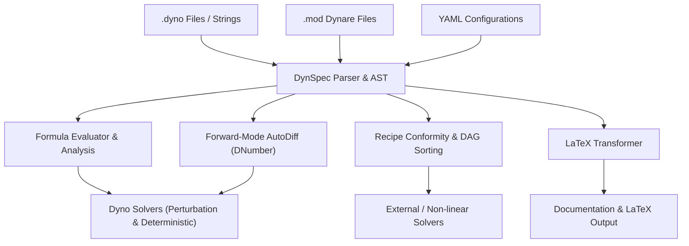

# DynSpec Specification Engine

**DynSpec** is the parsing, symbolic representation, and code-generation subsystem in Dyno. It parses model files into typed Abstract Syntax Trees (ASTs), validates equation structures against model recipes, evaluates mathematical expressions, and provides automatic differentiation via dual numbers.

---

## Overview

In dynamic economic modeling, decoupling model specification from specific solver backends improves reusability and testing:


```mermaid
graph TD
    A[".dyno Files / Strings"] --> B[DynSpec Parser & AST]
    C[".mod Dynare Files"] --> B
    D["YAML Configurations"] --> B

    B --> E["Formula Evaluator & Analysis"]
    B --> F["Forward-Mode AutoDiff (DNumber)"]
    B --> G["Recipe Conformity & DAG Sorting"]
    B --> H["LaTeX Transformer"]

    E --> I["Dyno Solvers (Perturbation & Deterministic)"]
    F --> I
    G --> J["External / Non-linear Solvers"]
    H --> K["Documentation & LaTeX Output"]
```

---

## Capabilities

<div class="grid cards" markdown>

-   ### Grammar & AST (`grammar.py`)
    An LALR(1) Lark grammar defining model declarations (`<-`), equilibrium equations (`=`), time indexing (`[t]`, `[t-1]`, `[t+1]`, `[~]`), and metadata blocks.

-   ### AST Analysis & Evaluation (`analyze.py`)
    Visitors and interpreters that evaluate steady-state expressions, verify residuals, and extract variable lists across time leads and lags.

-   ### Dual-Number AutoDiff (`autodiff.py`)
    A dual-number arithmetic engine (`DNumber`) providing exact analytical derivatives for lead, contemporaneous, and lagged variables in a single forward pass.

-   ### Model Recipes (`recipe.py`)
    A structural validation system (such as `DTCC_RECIPE`) that checks variable timing restrictions, equation counts, and computes topological evaluation order for recursive blocks.

-   ### Function Compilation (`funcgen.py`)
    Compiles symbolic equation trees into vectorized callable NumPy functions for non-linear iterative algorithms.

-   ### LaTeX Export (`latex.py`)
    Transforms parsed ASTs into clean LaTeX equations, automatically handling Greek variable names, time subscripts, and algebraic fractions.

</div>

---

## Standalone Usage Example

DynSpec can be used directly for parsing, AST inspection, variable extraction, and LaTeX generation:

```python
from dyno.dynspec.grammar import parser
from dyno.dynspec.recipe import extract_variables_from_equation
from dyno.dynspec.latex import latex

txt = """
y[t] = exp(z[t]) * k[t-1]^alpha
1/c[t] = beta * (1/c[t+1]) * (alpha * y[t+1]/k[t] + 1 - delta)
"""

# Parse an equation block
tree = parser.parse(txt, start="equation_block")
print("AST root node:", tree.data)

# Extract variables and time shifts from the first equation
first_equation = tree.children[0]
variables = extract_variables_from_equation(first_equation)
print("Variables in equation 1:", variables)
# {'y': {0}, 'z': {0}, 'k': {-1}}

# Convert equation AST nodes directly to LaTeX
for eq in tree.children:
    print(latex(eq))
```

---

## Subsystem Documentation

| Section | Focus |
|---|---|
| [**Grammar & AST**](grammar_ast.md) | Lark grammar structure, entry points, and AST node types. |
| [**Evaluation & AutoDiff**](analysis_autodiff.md) | Expression evaluation and `DNumber` automatic differentiation. |
| [**Model Recipes & Conformity**](recipes_conformity.md) | Defining model specifications (`Recipe`), timing rules, and DAG sorting. |
| [**Function Generation**](funcgen_compilation.md) | Compiling equation groups into callable NumPy functions. |
| [**LaTeX Export**](latex_export.md) | Exporting symbolic equations to LaTeX markup. |
