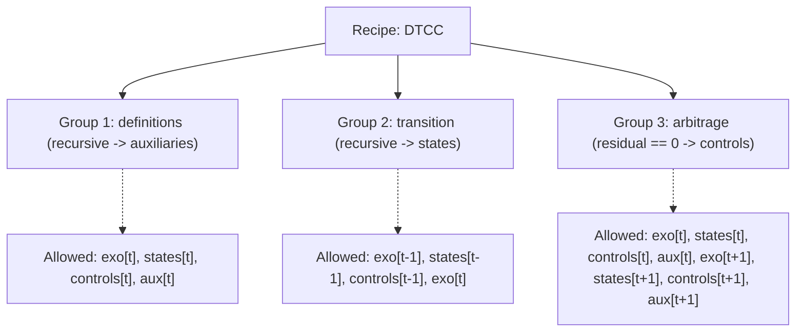

# Model Recipes & Conformity Checking

Different computational algorithms (perturbation, projection methods, value function iteration, global solving) require models to obey distinct mathematical structures and timing conventions.

DynSpec introduces **Model Recipes** (`dyno.dynspec.recipe`): formal, programmatic specifications of model structure that validate whether a set of equations conforms to a target solution paradigm.

---

## 1. What is a Recipe?

A **`Recipe`** defines:
1. **Variable Groups**: Valid classifications for variables (e.g. `exogenous`, `states`, `controls`, `auxiliaries`, `parameters`).
2. **Equation Groups**: Named blocks of equations with strict rules on:
   - Which variable groups may appear and at what time shifts (`allowed`).
   - Which variable group the equations define (`target`).
   - Whether the block is evaluated recursively or as a simultaneous zero-residual system (`recursive`).
   - Expected equation count (`n_equations`).



---

## 2. The `DTCC_RECIPE`

DynSpec includes a built-in recipe for **Discrete Time Continuous Controls (DTCC)** models (compatible with the Dolo framework):

```python
from dyno.dynspec.recipe import DTCC_RECIPE

print("Recipe name:", DTCC_RECIPE.name)
print("Variable groups:", DTCC_RECIPE.variable_groups)
# ['exogenous', 'states', 'controls', 'auxiliaries', 'parameters']

for group in DTCC_RECIPE.equation_groups:
    print(f"Group '{group.name}': target={group.target}, recursive={group.recursive}")
```

### The Three DTCC Equation Groups

| Group | Target | Nature | Timing Allowed |
|---|---|---|---|
| `definitions` | `auxiliaries` | Recursive assignment | $m_t, s_t, x_t, y_t$ |
| `transition` | `states` | Recursive state evolution | $m_{t-1}, s_{t-1}, x_{t-1}, m_t$ |
| `arbitrage` | None | Simultaneous residual $= 0$ | $m_t, s_t, x_t, y_t, m_{t+1}, s_{t+1}, x_{t+1}, y_{t+1}$ |

---

## 3. Conformity Checking

To verify whether a model adheres to a recipe, use `check_equation_group()`:

```python
from dyno.dynspec.recipe import DTCC_RECIPE, check_equation_group

# Define variable catalog
variables = {
    "exogenous": ["e_z"],
    "states": ["z", "k"],
    "controls": ["n", "i"],
}

# Verify transition equations
transition_spec = DTCC_RECIPE.get_group_spec("transition")
result = check_equation_group(
    transition_equations,
    variables=variables,
    spec=transition_spec,
    constants=["alpha", "beta", "delta", "rho"]
)

if result.ok:
    print("✓ Equations conform to recipe!")
    print("Topological evaluation order:", result.dag_order)
else:
    print("✗ Violations detected:")
    for violation in result.violations:
        print(f"  - {violation}")
```

### Violation Reporting

When equations violate recipe constraints, `ConformityResult` provides detailed diagnostics:
- Which equation violated the rule.
- Offending variable and its timing shift (e.g. `k[t-1]`).
- Explanation of why that variable is prohibited in the given equation group.

---

## 4. Directed Acyclic Graph (DAG) Topological Sorting

For recursive blocks (such as `definitions` and `transition`), equations must be evaluated in a valid causal sequence without circular dependencies.

DynSpec implements **Kahn's topological sort algorithm** in `check_dag()`:
1. Builds an adjacency graph where edges represent RHS variable dependencies.
2. Identifies variables with in-degree 0 (no uncomputed dependencies).
3. Traverses the graph to produce a deterministic, ordered list of equations.
4. Detects circular algebraic loops (e.g., $A$ depends on $B$ and $B$ depends on $A$).

```python
from dyno.dynspec.recipe import check_dag

# Computes valid evaluation sequence or returns None if a cycle exists
evaluation_order = check_dag(equations, target_names=["y", "c", "rk", "w"])
print("Evaluation order:", evaluation_order)
# ['y', 'c', 'rk', 'w']
```
