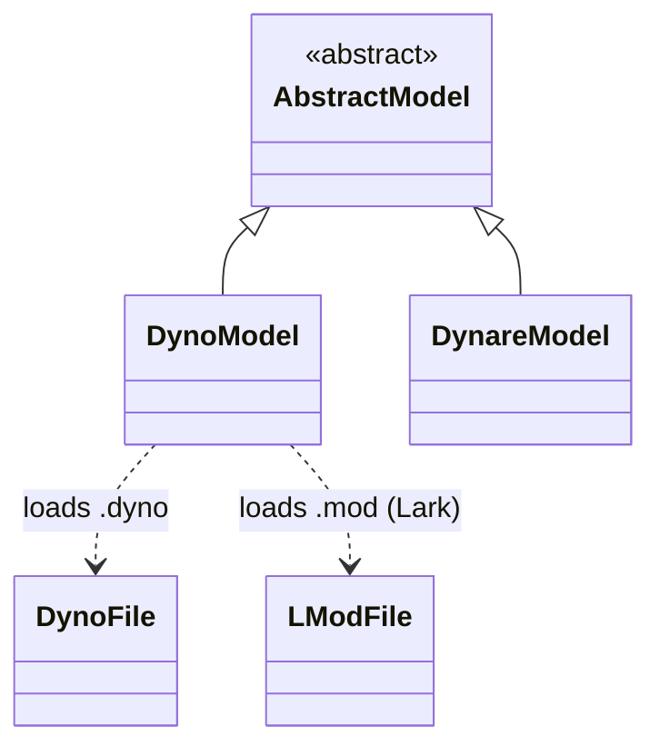

# Hierarchy of Model Classes




Notes:

- `AbstractModel` is the abstract base class for models.
- `DynoModel` and `DynareModel` are the main concrete model types.
- `DynoModel` uses `DynoFile` / `LModFile` (both `SymbolicModel` subclasses) to parse textual model descriptions.

## `DynoModel` vs `DynareModel`

Dyno currently exposes two main model classes for DSGE workflows:

- `DynoModel`
- `DynareModel`

They share the same high-level API (`context`, `symbols`, `solve`, `residuals`, `jacobians`), but differ slightly in parsing behavior and feature support.

### `DynoModel`

`DynoModel` is the native Dyno model class.

Supported inputs:

- Native `.dyno` files (recommended).
- Dynare `.mod` files through the internal Lark-based conversion route.

Important note on `.mod` support:

- `.mod` support in `DynoModel` is based on conversion/parsing and may involve some feature loss compared with full Dynare preprocessing.

About YAML:

- `DynoModel` now supports YAML wrappers where a `model` field contains native `.dyno` syntax.
- You can pass YAML text directly with `DynoModel(yaml=...)`.
- You can also load `.yaml` / `.yml` files.
- Every top-level YAML key except `model` is copied into `model.metadata`.
- `@key: value` statements inside the `model` block write to the same metadata dictionary.
- This means `@name: RBC` in the `model` block is equivalent to setting `name: RBC` at YAML top level.
- If both are present for the same key, the `@...` value from the `model` block takes precedence.

Example YAML wrapper:

```yaml
name: RBC
tags: [baseline, dsge]
model: |
    e[t] <- N(0,1)
    x[t] = 0.9 * x[t-1]
```

### `DynareModel`

`DynareModel` is the Dynare-preprocessor-backed model class.

Behavioral differences:

- It relies on Dynare's parsing/preprocessing semantics for `.mod` files.
- It is generally the safer option when you need higher-fidelity handling of original Dynare `.mod` features.

## Practical Guidance

- Use `DynoModel` for native `.dyno` projects and lightweight `.mod` compatibility.
- Use `DynareModel` when you want behavior closer to Dynare's original preprocessing for `.mod` files.

## DynoFile Class

`DynoFile` is the native parsed representation for `.dyno` syntax.
It lives below `DynoModel` and is usually accessed through `model.symbolic`.

### Role In The Stack

- `DynoModel(... .dyno/.yaml ...)` creates a `DynoFile` instance.
- `DynoFile` parses text into a Lark syntax tree.
- It evaluates assignments to build a normalized context.
- It stores equation trees and metadata consumed by higher-level model APIs.

### Constructor

```python
from dyno.larkfiles import DynoFile

sf = DynoFile(content=txt, filename="my_model.dyno")
```

On initialization, `DynoFile` immediately parses content and processes assignments.

### Main Attributes

| Attribute | Type | Meaning |
|---|---|---|
| `content` | `str` | Raw model source text. |
| `filename` | `str` | Source name used in diagnostics. |
| `tree` | `lark.Tree` | Full parsed syntax tree (`free_block`). |
| `context` | `dict` | Parsed context with `constants`, `variables`, `values`, `processes`, `steady_states`. |
| `equations` | `list[lark.Tree]` | Equation trees in parser order. |
| `metadata` | `dict[str, Any]` | Model-level metadata from `@key: value` assignments. |
| `processes` | `dict[tuple[str, ...], Any]` | Parsed exogenous process objects. |
| `residuals` | `list` | Equation residuals evaluated at current context steady-state values. |

### Main Methods

- `parse()`:
    parses the source text and stores `tree`, then calls `process_assignments()`.
- `process_assignments(**calib)`:
    walks the parse tree, applies optional calibration overrides, and refreshes
    `context`, `metadata`, `equations`, `processes`, `residuals`.
- `eval_residuals(context=None)`:
    evaluates equation residuals (steady-state mode) from a context dictionary.
- `latex_equations()`:
    returns equations rendered as a joined LaTeX string.

### Notes On Tags And Equation Metadata

Equation-level tags and inline metadata are attached to equation trees in
`eq.meta.statement_metadata` during assignment processing.

So, when using a `DynoModel`:

- `model.symbolic` is typically a `DynoFile`.
- `model.symbolic.equations[i].meta.statement_metadata` contains tags/metadata for equation `i`.
- `model.equations[i]` is the human-readable string form of the same equation.

### Typical Access Pattern Through DynoModel

```python
from dyno import DynoModel

model = DynoModel("examples/neo.dyno")
sym = model.symbolic  # DynoFile

print(type(sym).__name__)
print(sym.context.keys())
print(sym.metadata)
print(len(sym.equations))
```

## Where Model Information Lives (API)

This section summarizes where parsed model information is stored once you instantiate a model.

### Main Containers

- `model.symbolic`: low-level parsed representation (`DynoFile` or `LModFile`).
- `model.context`: normalized numeric/context dictionaries used by solvers.
- `model.metadata`: convenience property forwarding to `model.symbolic.metadata`.
- `model.equations`: string rendering of equations for display/debug.

### Storage Map

| Information | Main API | Value shape | Notes |
|---|---|---|---|
| Constants/parameters | `model.context["constants"]` | `dict[str, float]` | Includes assigned constants; missing constants referenced in equations may be inserted as `nan` in `DynoModel` normalization. |
| Variable declarations | `model.context["variables"]` | `dict[str, dict]` | Declaration-level information from parsing. |
| Steady-state values | `model.context["steady_states"]` | `dict[str, float]` | Used by residuals/jacobians and steady-state vectors. |
| Deterministic dated values | `model.context["values"]` | `dict[str, dict[int, float]]` | Values pinned at dates (`x[0] <- ...`, quantified assignments, etc.). |
| Exogenous processes | `model.context["processes"]` | `dict[tuple[str, ...], Any]` | Typically `Normal(...)` or product structures. |
| Equation trees | `model.symbolic.equations` | `list[lark.Tree]` | Canonical parsed equations used internally. |
| Equation text | `model.equations` | `list[str]` | Derived from `model.symbolic.equations` via string rendering. |
| Model metadata | `model.metadata` | `dict[str, Any]` | Includes top-level YAML metadata and in-model `@key: value` assignments. |
| Equation tags/inline metadata | `eq.meta.statement_metadata` | `dict[str, Any]` | Attached per equation tree (`tags`, optional key-value metadata). |

### Metadata Merge Rules (YAML + in-model)

For YAML-backed models:

- Top-level YAML keys except `model` are loaded into metadata.
- In-model `@key: value` assignments are loaded into the same metadata dictionary.
- If both define the same key, in-model metadata overrides top-level YAML.

### Quick Introspection Example

```python
from dyno import DynoModel

model = DynoModel("examples/neo.dyno.yaml")

# Core containers
print(model.context.keys())
print(model.metadata)

# Equations as text
for i, eq in enumerate(model.equations, start=1):
    print(i, eq)

# Equation-level tags/metadata from parsed trees
for i, eq_tree in enumerate(model.symbolic.equations, start=1):
    statement_meta = getattr(eq_tree.meta, "statement_metadata", {})
    print(i, statement_meta)
```

### Practical Rule of Thumb

- Use `model.context` for numeric workflows (solve/simulate/calibrate).
- Use `model.metadata` for run configuration and user-defined model descriptors.
- Use `model.symbolic.equations` when you need per-equation metadata/tags.
- Use `model.equations` when you only need readable equation strings.
