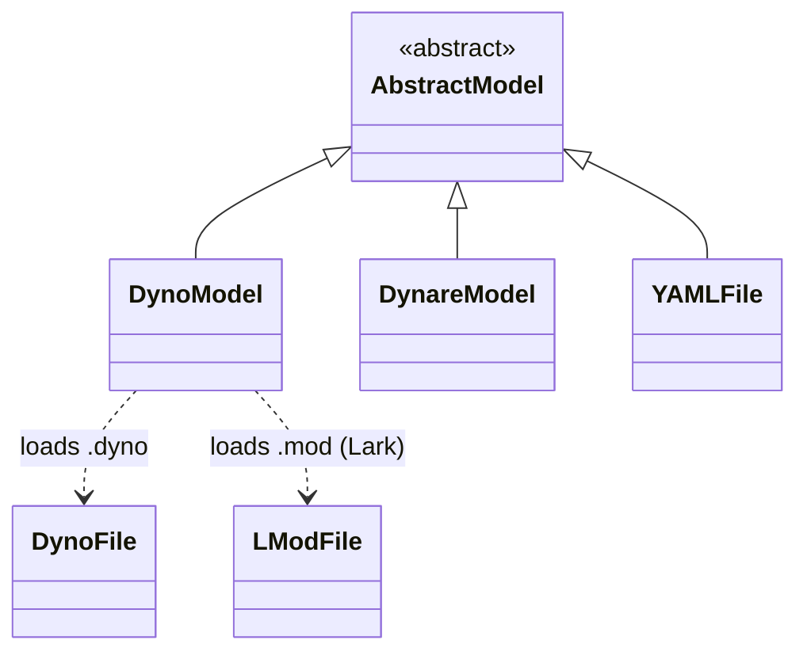

# Hierarchy of Model Classes




Notes:

- `AbstractModel` is the abstract base class for models.
- `DynoModel`, `DynareModel`, and `YAMLFile` are the main concrete model types.
- `DynoModel` uses `DynoFile` / `LModFile` (both `SymbolicModel` subclasses) to parse textual model descriptions.

## `DynoModel` vs `DynareModel`

Dyno currently exposes two main model classes for DSGE workflows:

- `DynoModel`
- `DynareModel`

They share the same high-level API (`context`, `symbols`, `solve`, `residuals`, `jacobians`), but differ slightly in parsing behavior and feature support.

### `DynoModel`

`DynoModel` is the native Dyno model class.

Supported inputs:

- Native `.dyno` files (recommended).
- Dynare `.mod` files through the internal Lark-based conversion route.

Important note on `.mod` support:

- `.mod` support in `DynoModel` is based on conversion/parsing and may involve some feature loss compared with full Dynare preprocessing.

About YAML:

- `DynoModel` now supports YAML wrappers where a `model` field contains native `.dyno` syntax.
- You can pass YAML text directly with `DynoModel(yaml=...)`.
- You can also load `.yaml` / `.yml` files.
- Every top-level YAML key except `model` is copied into `model.metadata`.
- `@key: value` statements inside the `model` block write to the same metadata dictionary.
- This means `@name: RBC` in the `model` block is equivalent to setting `name: RBC` at YAML top level.
- If both are present for the same key, the `@...` value from the `model` block takes precedence.

Example YAML wrapper:

```yaml
name: RBC
tags: [baseline, dsge]
model: |
    e[t] <- N(0,1)
    x[t] = 0.9 * x[t-1]
```

### `DynareModel`

`DynareModel` is the Dynare-preprocessor-backed model class.

Behavioral differences:

- It relies on Dynare's parsing/preprocessing semantics for `.mod` files.
- It is generally the safer option when you need higher-fidelity handling of original Dynare `.mod` features.

## Practical Guidance

- Use `DynoModel` for native `.dyno` projects and lightweight `.mod` compatibility.
- Use `DynareModel` when you want behavior closer to Dynare's original preprocessing for `.mod` files.
