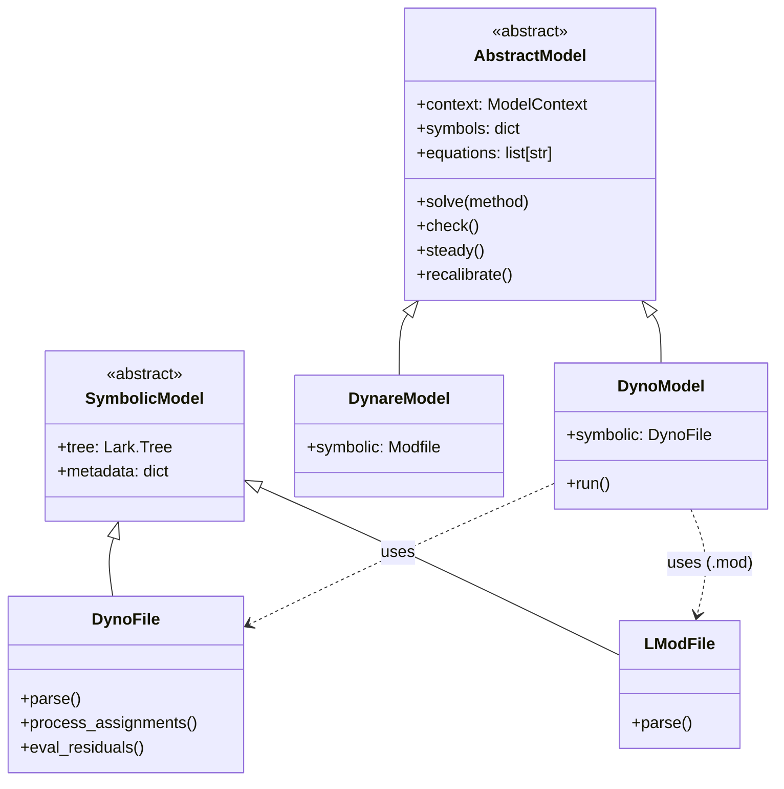

# Model Architecture & Data Structures

Understanding how Dyno stores and manages model state makes it easy to inspect, debug, and script advanced econometric workflows.

---

## Model Class Hierarchy

Dyno's model layer is built upon an extensible, object-oriented architecture:



### Core Classes

- **`AbstractModel`**: Abstract base class defining the shared DSGE interface: `solve()`, `check()`, `steady()`, `residuals`, `jacobians`, and `recalibrate()`.
- **`DynoModel`**: Concrete model class for native `.dyno` syntax and pure-Python `.mod` imports. Uses `DynoFile` or `LModFile`.
- **`DynareModel`**: Concrete model class backed by the official C++ Dynare preprocessor (`dynare-preprocessor-pylib`).
- **`DynoFile`**: The parsed symbolic representation containing the Lark abstract syntax tree (AST), raw equations, and assignment environments.

---

## Where Model Information Lives

Once instantiated, a model stores information across several structured containers:

| Container | Type | Purpose | Key Attributes |
|---|---|---|---|
| `model.context` | `dict` | Normalized numerical values used by solvers | `constants`, `steady_states`, `values`, `processes`, `variables` |
| `model.symbols` | `dict[str, list[str]]` | Catalog of declared symbols | `endogenous`, `exogenous`, `parameters` |
| `model.metadata` | `dict[str, Any]` | Top-level metadata and annotations | `name`, `author`, `tags`, custom fields |
| `model.equations` | `list[str]` | Human-readable string representations of equations | Equation strings in model order |
| `model.symbolic` | `DynoFile` | Low-level Lark AST and equation trees | `equations` (Lark trees), `tree` |

---

## The `model.context` Dictionary

The `context` dictionary is the mathematical engine room of Dyno. It contains five primary keys:

```python
model.context.keys()
# dict_keys(['constants', 'steady_states', 'values', 'processes', 'variables'])
```

1. **`constants`** (`dict[str, float]`):
   Stores all calibrated scalar parameters (e.g. `{'alpha': 0.36, 'beta': 0.99}`).

2. **`steady_states`** (`dict[str, float]`):
   Stores steady-state levels for all endogenous and exogenous variables (e.g. `{'k': 10.0, 'c': 0.8}`).

3. **`values`** (`dict[str, dict[int, float]]`):
   Stores date-specific overrides or deterministic shock paths (e.g. `{'e': {0: 0.02, 1: 0.01}}`).

4. **`processes`** (`dict[tuple[str, ...], Any]`):
   Contains Gaussian shock distribution objects (`Normal(mu, sigma2)`) mapping variable names to their stochastic parameters.

5. **`variables`** (`dict[str, dict]`):
   Tracks metadata for all variables encountered in model equations.

---

## Introspection Examples

```python
from dyno import DynoModel

model = DynoModel("examples/neo.dyno")

# 1. Inspect parameters
print("Parameters:", model.context["constants"])

# 2. Inspect steady states
print("Steady State values:", model.steady_state)

# 3. View equations as readable strings
for i, eq in enumerate(model.equations, 1):
    print(f"Eq {i}: {eq}")

# 4. Access low-level symbolic AST
first_equation_tree = model.symbolic.equations[0]
print("Lark AST Node:", first_equation_tree.data)
```

---

## Programmatic Model Manipulation

Dyno provides functional methods for non-destructive model updates:

### Recalibration
Create a clone of the model with updated parameter values:

```python
model_new = model.recalibrate(beta=0.985, alpha=0.35)
assert model_new.context["constants"]["beta"] == 0.985
assert model.context["constants"]["beta"] != 0.985  # Original untouched
```

### Deep Copy
```python
model_copy = model.copy()
```

---

## Package Organization & Incubated Subpackages

The Dyno repository is architected as an umbrella workspace incubating specialized subsystems designed to eventually become independent, standalone packages:

```text
dyno/
├── dynspec/          # Universal specification, parsing, recipes, and autodiff
├── dynare/           # New version of Dynare in Python (DynareModel & preprocessor bridge)
├── solvers/          # Numerical steady-state, perturbation, and deterministic solvers
├── simul/            # Stochastic simulation, Monte Carlo, and IRF engines
└── report/           # Automated execution pipelines, MIME diagnostics, and rich display
```

### The Incubation Model

1. **`dyno.dynspec` (Future Specification Engine)**:
   - Contains the language grammar, AST transformation rules (`TimeFixer`), forward-mode automatic differentiation (`DNumber`), and model recipes (`DTCC_RECIPE`).
   - Completely solver-agnostic, designed to be extracted into a standalone package for general economic modeling frameworks.
   - See the [DynSpec Documentation](../dynspec/index.md).

2. **`dyno.dynare` (Future Dynare in Python Package)**:
   - Contains the new Python implementation of Dynare, currently featuring [`DynareModel`](../dynare/index.md) and bridges to the official C++ preprocessor.
   - Maintained with clean boundary isolation so it can be spun off into an autonomous `dynare` package.
   - See the [Dynare Subpackage Documentation](../dynare/index.md).

3. **`dyno` (Modeling Language)**:
   - A fresh take on a modeling language for dynamic macroeconomic models, combining intuitive equation syntax, perturbation and deterministic solvers, and publication-ready reporting into an expressive workflow.
