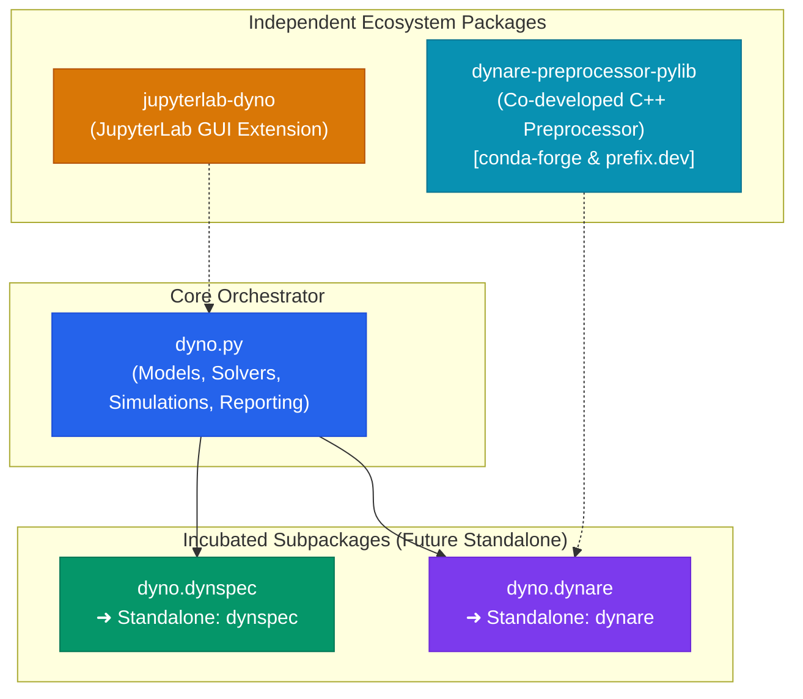

# Subpackages & Development Plans

Dyno serves not only as a high-level DSGE modeling framework, but also as an **incubation umbrella** for specialized packages in computational economics.

Rather than maintaining a monolithic codebase, Dyno is architected around modular subpackages designed with strict boundary separation. As these modules mature, they will be spun off into **independent, standalone packages** with their own repositories and release cycles on PyPI and conda-forge.



---

## The Two Incubated Subpackages

### 1. DynSpec (`dyno.dynspec`) — Universal Specification Engine

- **Mission**: Provide a solver-agnostic, language-independent specification and AST engine for dynamic economic models.

- **Current Status**: Incubated within Dyno under `src/dyno/dynspec/`.

- **Core Capabilities**:
  - Declarative Lark EBNF grammar for economic equations and timing shifts (`[t]`, `[t-1]`, `[t+1]`, `[~]`).
  - AST transformation and source coordinate tracking (`TimeFixer`, `propagate_positions`).
  - Directed Acyclic Graph (DAG) topological dependency resolution (`check_dag`).
  - Formal model recipes (`DTCC_RECIPE`) with strict variable group and timing conformity checks.
  - Forward-mode automatic differentiation (`DNumber`) evaluating exact machine-precision Jacobians without symbolic explosion.
  - Just-In-Time (JIT) NumPy code compilation and LaTeX equation formatting.

- **Independence Plan**: Will be extracted into a standalone package `dynspec` usable across perturbation solvers, global projection libraries (such as Dolo), and agent-based platforms.

- **Documentation**: Explore the [DynSpec Architecture & Guide](../dynspec/index.md).

---

### 2. Dynare in Python (`dyno.dynare`) — The Modern Dynare Reimplementation

- **Mission**: Bring native, first-class Dynare modeling to the modern Python scientific ecosystem.

- **Current Status**: Incubated within Dyno under `src/dyno/dynare/`.

- **Core Capabilities**:
  - Pythonic interface class [`DynareModel`](../dynare/index.md) implementing the standard `AbstractModel` contract.
  - Direct integration with the **co-developed C++ preprocessor Python library** (`dynare-preprocessor-pylib`), distributed on **conda-forge** and **prefix.dev** (`https://prefix.dev/econforge`), delivering 100% syntactic parity with official Dynare `.mod` files and macro-processing commands.
  - Seamless coupling with Dyno's first-order perturbation solvers (QZ Schur decomposition and Time Iteration).
  - Production-ready exports to Pandas DataFrames and interactive Plotly visualization.

- **Independence Plan**: Will graduate into an independent `dynare` Python package with a standalone CLI (`dynare model.mod`), complete command emulation (`stoch_simul`, `steady`, `check`, `forecast`), and pure-Python parsing fallbacks.

- **Documentation**: Explore the [Dynare Subpackage Guide](../dynare/index.md).

---

## Independent Ecosystem Packages

Beyond the subpackages currently being incubated, the broader Dyno ecosystem already relies on independent companion packages:

### JupyterLab Dyno (`jupyterlab-dyno` / Dyno Lab)

Unlike `dynspec` and `dyno.dynare`, **`jupyterlab-dyno` is not an incubated subpackage**; it is **already an independent package** distributed as a standalone JupyterLab extension on npm and the EconForge channel.

- **Architecture**: Decouples the interactive CodeMirror editor, live split-panel report viewer, and real-time Plotly charts from the underlying computational kernel.
- **Packaging**: Maintained in a separate repository and installable directly into JupyterLab environments via `pixi` or `micromamba`:
  ```bash
  pixi add --channel https://repo.prefix.dev/econforge jupyterlab_dyno
  ```
- **Documentation**: Explore the dedicated [Dyno Lab (GUI)](../dyno_lab/index.md) section.

### Dynare C++ Preprocessor Python Library (`dynare-preprocessor-pylib`)

A co-developed Python library wrapping the official Dynare C++ preprocessor codebase:

- **Availability**: Distributed on **conda-forge** and **prefix.dev** (`https://prefix.dev/econforge`).
- **Functionality**: Performs in-memory parsing and AST generation of `.mod` files directly into Python data structures, avoiding intermediate file generation or CLI subprocess overhead.

---

## Subsystem Matrix

| Subsystem | Category | Current Location | Standalone Package Name | Primary Responsibility |
|---|---|---|---|---|
| **DynSpec** | Incubated Subpackage | `dyno.dynspec` | `dynspec` | Grammar, AST, recipes, DAG sorting, autodiff, code generation |
| **Dynare in Python** | Incubated Subpackage | `dyno.dynare` | `dynare` | Dynare `.mod` compatibility, C++ preprocessor bridge, command emulation |
| **Dynare Preprocessor** | Independent Library | `dynare-preprocessor-pylib` | `dynare-preprocessor-pylib` | Co-developed C++ preprocessor Python bindings (conda-forge & prefix.dev) |
| **Dyno Lab** | Independent Extension | `jupyterlab_dyno` | `jupyterlab-dyno` | JupyterLab IDE extension, reactive workspace, editor diagnostics |
| **Dyno Core** | Core Orchestrator | `dyno` | `dyno` | High-level orchestrator, perturbation & deterministic solvers, simulation, reporting |

---

## Development Roadmap

The transition of incubated subpackages toward autonomous packages follows a three-stage roadmap:

### Phase 1: Modular Encapsulation (Current Phase)

- Isolate internal dependencies into dedicated subpackage directories (`dyno.dynspec`, `dyno.dynare`).
- Establish stable public interfaces (`DynareModel`, `DynoModel`, `FormulaEvaluator`, `Recipe`).
- Integrate with external ecosystem components (`jupyterlab-dyno`, `dynare-preprocessor-pylib`).
- Provide unified documentation and comprehensive automated test suites.

### Phase 2: Decoupled Extraction

- Extract `dynspec` and `dynare` into dedicated standalone repositories or independent workspace members in a Pixi multi-package monorepo.
- Expose standalone command-line entry points.
- Implement bidirectional AST translations between Dynare `.mod` files and DynSpec models.

### Phase 3: Autonomous Ecosystem Release

- Publish independent `dynspec` and `dynare` distributions to PyPI and conda-forge alongside `jupyterlab-dyno` and `dynare-preprocessor-pylib`.
- `dyno` becomes a lightweight meta-package orchestrating these specialized engines while maintaining its intuitive top-level user experience.
