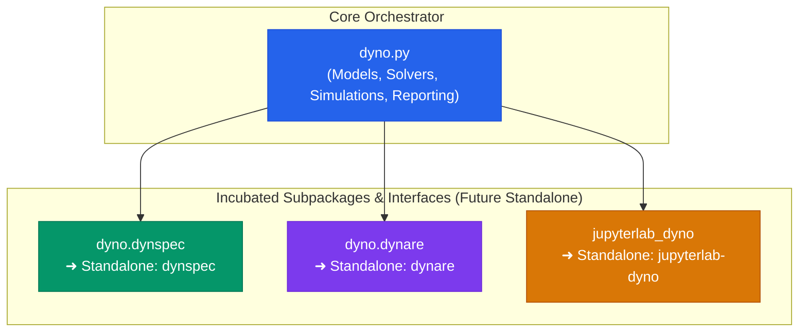

# Subpackages & Development Plans

Dyno serves not only as a high-level DSGE modeling framework, but also as an **incubation umbrella** for specialized packages in computational economics.

Rather than maintaining a monolithic codebase, Dyno is architected around modular subpackages designed with strict boundary separation. As these modules mature, they will be spun off into **independent, standalone packages** with their own repositories and release cycles on PyPI and conda-forge.

---

## The Three Incubated Subsystems

### 1. DynSpec (`dyno.dynspec`) — Universal Specification Engine

- **Mission**: Provide a solver-agnostic, language-independent specification and AST engine for dynamic economic models.
- **Current Status**: Incubated within Dyno under `src/dyno/dynspec/`.
- **Core Capabilities**:
  - Declarative Lark EBNF grammar for economic equations and timing shifts (`[t]`, `[t-1]`, `[t+1]`, `[~]`).
  - AST transformation and source coordinate tracking (`TimeFixer`, `propagate_positions`).
  - Directed Acyclic Graph (DAG) topological dependency resolution (`check_dag`).
  - Formal model recipes (`DTCC_RECIPE`) with strict variable group and timing conformity checks.
  - Forward-mode automatic differentiation (`DNumber`) evaluating exact machine-precision Jacobians without symbolic explosion.
  - Just-In-Time (JIT) NumPy code compilation and LaTeX equation formatting.
- **Independence Plan**: Will be extracted into a standalone package `dynspec` usable across perturbation solvers, global projection libraries (such as Dolo), and agent-based platforms.
- **Documentation**: Explore the [DynSpec Architecture & Guide](../dynspec/index.md).

---

### 2. Dynare in Python (`dyno.dynare`) — The Modern Dynare Reimplementation

- **Mission**: Bring native, first-class Dynare modeling to the modern Python scientific ecosystem.
- **Current Status**: Incubated within Dyno under `src/dyno/dynare/`.
- **Core Capabilities**:
  - Pythonic interface class [`DynareModel`](../dynare/index.md) implementing the standard `AbstractModel` contract.
  - Direct integration with the official C++ Dynare preprocessor (`dynare-preprocessor-pylib`) for 100% fidelity with legacy `.mod` syntax and macro-processing blocks.
  - Seamless coupling with Dyno's first-order perturbation solvers (QZ Schur decomposition and Time Iteration).
  - Production-ready exports to Pandas DataFrames and interactive Plotly visualization.
- **Independence Plan**: Will graduate into an independent `dynare` Python package with a standalone CLI (`dynare model.mod`), complete command emulation (`stoch_simul`, `steady`, `check`, `forecast`), and pure-Python parsing fallbacks.
- **Documentation**: Explore the [Dynare Subpackage Guide](../dynare/index.md).

---

### 3. JupyterLab Dyno (`jupyterlab_dyno` / Dyno Lab) — Interactive Web GUI

- **Mission**: Provide a live, reactive graphical environment for DSGE model authoring and inspection inside the JupyterLab IDE.
- **Current Status**: Distributed as an extension package (`jupyterlab_dyno`) on the EconForge channel, replacing earlier prototypes (such as Solara).
- **Core Capabilities**:
  - Coordinated side-by-side workspace: CodeMirror editor on the left, Dyno Report viewer on the right.
  - Live reactive re-rendering: edits in code automatically re-solve the model after a debounced typing pause.
  - Scroll preservation: maintains viewer scroll position across model re-evaluations.
  - Inline code diagnostics: syntax errors and steady-state mismatches are highlighted with line markers in the code editor via custom MIME bundles.
  - Per-file Dyno Options sidebar for real-time adjustments to approximation order, simulation horizons, and IRF formats (`level`, `deviation`, `log-deviation`).
- **Independence Plan**: Maintained as an autonomous JupyterLab extension package installable via Pixi and Micromamba (`pixi add --channel https://repo.prefix.dev/econforge jupyterlab_dyno`).
- **Documentation**: Explore the [Dyno Lab Interface Guide](../dyno_lab/index.md).

---

## Subsystem Matrix

| Subsystem | Current Location | Target Autonomous Package | Primary Responsibility |
|---|---|---|---|
| **DynSpec** | `dyno.dynspec` | `dynspec` | Grammar, AST, recipes, DAG sorting, autodiff, code generation |
| **Dynare in Python** | `dyno.dynare` | `dynare` | Dynare `.mod` compatibility, C++ preprocessor bridge, command emulation |
| **Dyno Lab** | `jupyterlab_dyno` | `jupyterlab-dyno` | JupyterLab extension, reactive UI, editor diagnostics, live plotting |
| **Dyno Core** | `dyno` | `dyno` | High-level orchestrator, perturbation & deterministic solvers, simulation, reporting |

---

## Development Roadmap

The transition of incubated subsystems toward autonomous packages follows a three-stage roadmap:

### Phase 1: Modular Encapsulation (Current Phase)

- Isolate internal dependencies into dedicated subpackage directories (`dyno.dynspec`, `dyno.dynare`).
- Establish stable public interfaces (`DynareModel`, `DynoModel`, `FormulaEvaluator`, `Recipe`).
- Provide unified documentation and comprehensive automated test suites.

### Phase 2: Decoupled Extraction

- Extract `dynspec` and `dynare` into dedicated standalone repositories or independent workspace members in a Pixi multi-package monorepo.
- Expose standalone command-line entry points.
- Implement bidirectional AST translations between Dynare `.mod` files and DynSpec models.

### Phase 3: Autonomous Ecosystem Release

- Publish independent `dynspec`, `dynare`, and `jupyterlab-dyno` distributions to PyPI and conda-forge.
- `dyno` becomes a lightweight meta-package orchestrating these specialized engines while maintaining its intuitive top-level user experience.
