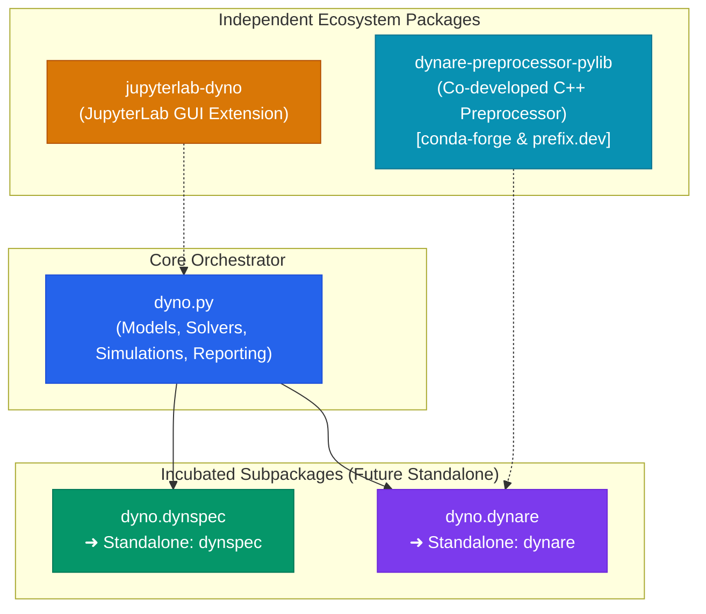

# Subpackages & Roadmap

Dyno acts as an incubation umbrella for specialized tools in computational economics. Rather than maintaining a monolithic codebase, core subsystems are developed with strict modular boundaries inside Dyno until they mature into autonomous packages with independent release cycles on PyPI and conda-forge.

---

## Incubated Subpackages

### DynSpec (`dyno.dynspec`)

**DynSpec** is a language-independent, solver-agnostic specification and AST engine for dynamic economic models. It handles declarative EBNF grammar parsing, AST transformations, topological dependency sorting, formal model recipes, forward-mode automatic differentiation (`DNumber`), and JIT NumPy compilation. Currently incubated in `dyno.dynspec`, it will graduate into an autonomous `dynspec` package usable across diverse macroeconomic frameworks.

Detailed architecture, AST grammar, recipes, and autodiff documentation are available in the [DynSpec Specification Engine Guide](../dynspec/index.md).

---

### Dynare in Python (`dyno.dynare`)

**`dyno.dynare`** brings first-class, Pythonic Dynare modeling to modern scientific workflows. Built around `DynareModel`, it interfaces directly with a co-developed C++ preprocessor Python library (`dynare-preprocessor-pylib`, distributed on conda-forge and prefix.dev) to ensure exact syntax and macro-processing parity with official Dynare `.mod` files. In the future, `dyno.dynare` will graduate into an independent `dynare` package featuring a standalone CLI, full command emulation, and pure-Python parsing fallbacks.

For usage workflows, lifecycle details, and migration examples, explore the [Dynare in Python Guide](../dynare/index.md).

---

## Autonomous Ecosystem Packages

The broader Dyno ecosystem also relies on independent companion tools. **JupyterLab Dyno** (`jupyterlab-dyno`) is an already-independent package providing an interactive, live split-panel workspace and Plotly visualization inside JupyterLab (detailed in the [Dyno Lab Guide](../dyno_lab/index.md)). Under the hood, Dynare `.mod` ingestion is powered by **`dynare-preprocessor-pylib`**, a co-developed C++ Python binding distributed on conda-forge and prefix.dev for fast in-memory AST generation without disk overhead or external CLI wrappers.

---

## Development Roadmap

Development follows a three-phase transition plan:

**Phase 1: Modular Encapsulation (Current)** focuses on establishing clean internal interfaces (`DynareModel`, `DynoModel`, `FormulaEvaluator`, `Recipe`) and comprehensive test coverage while incubating inside the `dyno` repository.

**Phase 2: Decoupled Extraction** will spin off `dynspec` and `dynare` into standalone repositories or workspace members, complete with independent command-line entry points and bidirectional translation tools.

**Phase 3: Ecosystem Harmony** will see independent releases published to PyPI and conda-forge. Downstream libraries will be able to depend directly on `dynspec` or `dynare`, while `dyno` continues to serve as the unified, high-level modeling orchestrator.

